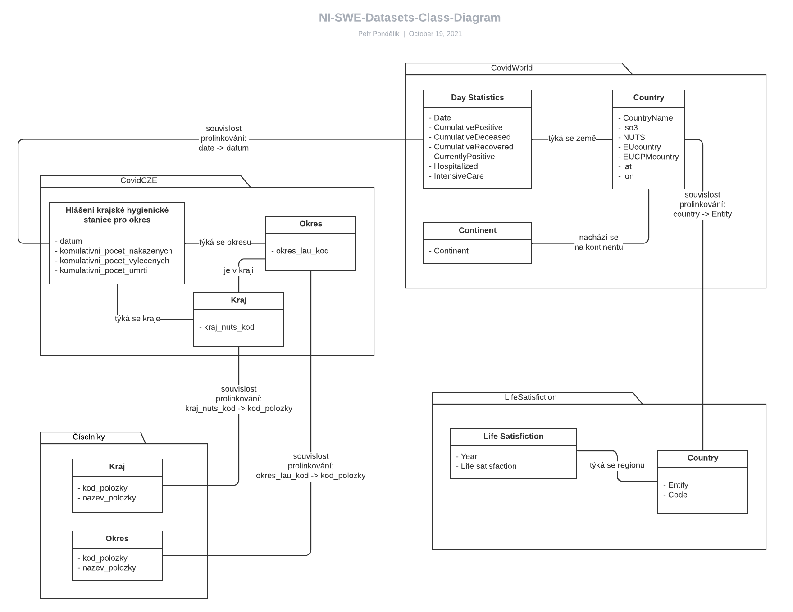

= NI-SWE Semestral project

== Source

Following data was chosen:

* three datasets
    ** Life satisfaction
    ** Covid-19 world data
    ** Covid-19 czech data
* two dials from common datasource
    ** CZ regions (kraje)
    ** CZ districts (okresy)

=== Diagram

== Download

**Directory structure of `download/data` directory**

* `data/` ... downloaded input data in CSV format
* `samples/`
    ** `iri_patterns.txt` ... copy of the following description of used IRI patterns
    ** `turtle/` ... instance samples for particular datasets and vocabulary sample
* `tarql-1.2/` ... copy of turtle application
* `triplifier` ... SPARQL CONSTRUCT queries for triplification of the input data and `run.sh` bash script
* `output` ... triplified output data

=== IRI Patterns

Veškeré zdroje jsou organizovány na abstraktní doméně http://www.example.org

==== Třídy a predikáty

* existují 4 kategorie slovníků
* první slovník je společný
* dostupný pod prefixem vocabulary/ na IRI http://www.example.org/vocabulary/
* zbývající 3 slovníky jsou organizovány pomocí prefixů příslušných datasetům a dále prefixu vocabulary/
* http://www.example.org/life-satisfaction/vocabulary/
* http://www.example.org/covid-world/vocabulary/
* http://www.example.org/covid-cze/vocabulary/

==== Číselníky

Číselníky krajů a okresů jsou hierarchicky organizovány pod prefixem ciselniky/

* číselník krajů: http://www.example.org/ciselniky/kraje/
* příklad: http://www.example.org/ciselniky/kraje/CZ020
* číselník okresů: http://www.example.org/ciselniky/okresy/
* příklad: http://www.example.org/ciselniky/okresy/CZ0324

==== Life Satisfaction

Dataset je dostupný pod prefixem life-satisfaction/ +
Obsahuje instance zemí a pozorování. +

Země jsou dostupné pod prefixem countries/

* http://www.example.org/life-satisfaction/countries
* příklad: http://www.example.org/life-satisfaction/countries/Finland

Pozorování jsou organizovány dle země a roku pod IRI příslušné země.

* příklad: http://www.example.org/life-satisfaction/countries/Finland/2019

==== Covid World

Dataset je dostupný pod prefixem covid-world/ +
Obsahuje instance kontinentů, zemí a pozorování.

Kontinenty jsou dostupné pod prefixem continents/

* http://www.example.org/covid-world/continents/
* příklad: http://www.example.org/covid-world/continents/EU

Země jsou dostupné pod prefixem countries/

* http://www.example.org/covid-world/countries/
* příklad: http://www.example.org/covid-world/countries/DNK

Pozorování jsou organizována pod konkrétními zeměmi dle data:

* http://www.example.org/covid-world/countries/DNK/2020-08-28

==== Covid CZE

Obsahuje instance krajů, okresů a pozorování.

Kraje jsou dostupné pod prefixem kraje/

* http://www.example.org/covid-cze/kraje/
* příklad: http://www.example.org/covid-cze/kraje/CZ020

Okresy jsou dostupné pod prefixem okresy/

* http://www.example.org/covid-cze/okresy/
* příklad: <http://www.example.org/covid-cze/okresy/CZ0201

Pozorování jsou organizována dle země a data pod IRI příslušeného okresu.

* příklad: http://www.example.org/covid-cze/okresy/CZ0201/2021-05-13

== Queries 1: Separate

=== SPARQL server: Apache Jena Fuseki

**Fix the volume concurrency error**

[source,bash]
----
docker exec -it fuseki bash

root@7fc3133f5863:/jena-fuseki# apt-get update
root@7fc3133f5863:/jena-fuseki# apt-get install -y procps
root@7fc3133f5863:/jena-fuseki# exit
----

**Build fixed image**

[source,bash]
----
sudo docker build -t jena-fuseki-fixed .
----

**Run Apache Jena Fuseki container**

[source,bash]
----
# Basic
sudo docker run -d --name fuseki -p 3030:3030 -v fuseki-data:/fuseki stain/jena-fuseki

# Fixed
sudo docker run --name fuseki -p 3030:3030 -e ADMIN_PASSWORD=pw123 -v fuseki-data:/fuseki jena-fuseki-fixed
----

=== Valuable knowledge

==== Covid World dataset

113 896 unique observations in covid-world -> some (date, iso3) duplicities exist +
113 561 unique observations without WW (global worlds numbers) records

== Linking and Queries 2: Combined

=== Linking

Pro statistická data z EU: +
https://op.europa.eu/en/web/eu-vocabularies/authority-tables

== Annotations

== SHACL

